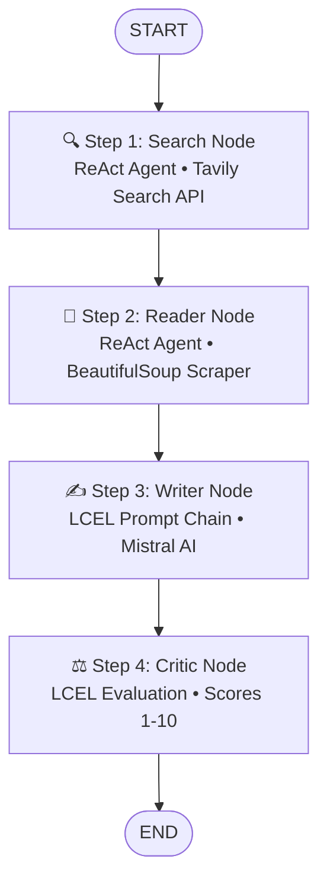

# 🧠 ResearchFlow AI — Autonomous Multi-Agent Research System

[](https://nextjs.org/)
[](https://fastapi.tiangolo.com/)
[](https://langchain-ai.github.io/langgraph/)
[](https://mistral.ai/)
[](https://www.typescriptlang.org/)
[](https://tailwindcss.com/)

**ResearchFlow AI** is a full-stack, enterprise-grade autonomous research platform. Given any complex research topic, ResearchFlow AI orchestrates a team of specialized AI agents using **LangGraph** to search the web, scrape deep source content, synthesize a structured markdown report, and critically evaluate the report's accuracy and depth with automated scoring.

---

## 📑 Table of Contents

- [Overview & Key Features](#-overview--key-features)
- [System Architecture](#-system-architecture)
- [Multi-Agent Execution Pipeline](#-multi-agent-execution-pipeline)
- [Monorepo Structure](#-monorepo-structure)
- [Tech Stack](#-tech-stack)
- [Getting Started & Setup](#-getting-started--setup)
- [API Reference](#-api-reference)
- [Subdirectory Readmes](#-subdirectory-readmes)

---

## 🚀 Overview & Key Features

- 🤖 **Autonomous Multi-Agent Collaboration**: 4 specialized agents (**Search**, **Reader**, **Writer**, and **Critic**) work sequentially to conduct end-to-end research.
- ⚡ **Real-Time SSE Streaming**: Live agent progress updates emitted via Server-Sent Events (`POST /research/stream`), updating the user interface as each agent completes its work.
- 🎯 **Automated Critique & Scoring**: A dedicated Critic Agent evaluates the generated report, providing a numerical score ($X/10$), key strengths, areas to improve, and a single-line verdict.
- 🌐 **Deep Web Scraping**: Integrates **Tavily Web Search** for link discovery and `BeautifulSoup4` for clean DOM content extraction from top sources.
- 💎 **Modern Glassmorphism UI**: High-end dark theme frontend built with **Next.js 16**, **React 19**, **Tailwind CSS v4**, and custom typography (**Urbanist** & **Geist Mono**).

---

## 📊 System Architecture

```
                                +-----------------------------------+
                                |   User Interface (Next.js 16)     |
                                |  Topic Input & Preset Badges      |
                                +-----------------+-----------------+
                                                  |
                                    POST /research/stream (SSE)
                                                  |
                                                  v
                                +-----------------------------------+
                                |    FastAPI Backend Server         |
                                |   (routes.py & StreamingResponse) |
                                +-----------------+-----------------+
                                                  |
                                                  v
                                +-----------------------------------+
                                |   LangGraph Engine (StateGraph)   |
                                |       Shared ResearchState        |
                                +-----------------+-----------------+
                                                  |
                                                  v
                                +-----------------------------------+
                                |   1. Search Node (ReAct / Tavily) |
                                +-----------------+-----------------+
                                                  |
                                                  v
                                +-----------------------------------+
                                |   2. Reader Node (BS4 Scraper)    |
                                +-----------------+-----------------+
                                                  |
                                                  v
                                +-----------------------------------+
                                |   3. Writer Node (LCEL / Mistral) |
                                +-----------------+-----------------+
                                                  |
                                                  v
                                +-----------------------------------+
                                |   4. Critic Node (Score & Review) |
                                +-----------------+-----------------+
                                                  |
                                                  v
                                +-----------------------------------+
                                |  Server-Sent Event (SSE) Stream   |
                                | (Live steps 1-4 & Final Result)   |
                                +-----------------+-----------------+
                                                  |
                                                  v
                                +-----------------------------------+
                                |   Tabbed UI (Report, Feedback,    |
                                |   Search Results, Scraped Sources)|
                                +-----------------------------------+
```

---

## 🔄 Multi-Agent Execution Pipeline



### Agent Roles & State Transitions

1. **State Initialization (`ResearchState`)**:
   - State dict created with `{"topic": topic}`.
2. **Search Agent ([backend/agents/search_agent.py](file:///c:/Users/sreem/Desktop/research-flow-ai/backend/agents/search_agent.py))**:
   - Queries Tavily API for top 5 web results and updates `state["search_results"]`.
3. **Reader Agent ([backend/agents/reader_agent.py](file:///c:/Users/sreem/Desktop/research-flow-ai/backend/agents/reader_agent.py))**:
   - Selects the best URL from search results, scrapes body text via `requests` + `BeautifulSoup`, and updates `state["scraped_content"]`.
4. **Writer Agent ([backend/agents/writer_agent.py](file:///c:/Users/sreem/Desktop/research-flow-ai/backend/agents/writer_agent.py))**:
   - Synthesizes search results and scraped content into a markdown report saved in `state["report"]`.
5. **Critic Agent ([backend/agents/critic_agent.py](file:///c:/Users/sreem/Desktop/research-flow-ai/backend/agents/critic_agent.py))**:
   - Evaluates report quality, outputting a numerical score (`Score: X/10`), strengths, weaknesses, and verdict into `state["feedback"]`.

---

## 📁 Monorepo Structure

```
research-flow-ai/
├── Readme.md                   # Project-wide documentation (this file)
├── backend/                    # FastAPI & LangGraph multi-agent service
│   ├── Readme.md               # Backend documentation
│   ├── app.py                  # FastAPI application entrypoint
│   ├── requirements.txt        # Python backend dependencies
│   ├── .env                    # Environment keys (Mistral & Tavily API keys)
│   ├── api/                    # REST routes and Pydantic schemas
│   ├── agents/                 # Agent definitions (Search, Reader, Writer, Critic)
│   ├── graph/                  # LangGraph StateGraph, nodes, and state definitions
│   ├── services/               # Mistral LLM client and prompt templates
│   └── tools/                  # Custom tools (Tavily search & BeautifulSoup scraper)
└── frontend/                   # Next.js 16 web application
    ├── README.md               # Frontend documentation
    ├── package.json            # Frontend scripts & dependencies
    ├── app/                    # Next.js App Router (pages, layout, Tailwind styles)
    ├── components/             # React UI components (Hero, Progress, Tabs, ScoreBadge)
    └── lib/                    # API client, SSE stream reader, and TypeScript types
```

---

## 🛠️ Tech Stack

### Backend
- **Framework**: FastAPI + Uvicorn
- **Orchestration**: LangGraph (`StateGraph`)
- **Agent Framework**: LangChain + LCEL
- **LLM**: Mistral AI (`mistral-small-latest`)
- **Search Engine**: Tavily Search API
- **Web Scraper**: BeautifulSoup4 + Requests

### Frontend
- **Framework**: Next.js 16 (App Router) + React 19
- **Language**: TypeScript
- **Styling**: Tailwind CSS v4 + Custom Glassmorphism System
- **Markdown Parsing**: `react-markdown` + `remark-gfm`
- **Fonts**: Urbanist & Geist Mono (`next/font`)

---

## ⚡ Getting Started & Setup

### Prerequisites
- **Node.js** 18+ & **npm**
- **Python** 3.10+
- **API Keys**:
  - Mistral AI API Key ([Console](https://console.mistral.ai/))
  - Tavily API Key ([Console](https://tavily.com/))

---

### Step 1: Set Up Backend

```bash
cd backend

# Create & activate virtual environment
python -m venv .venv

# On Windows (PowerShell):
.venv\Scripts\Activate.ps1
# On Linux/macOS:
source .venv/bin/activate

# Install dependencies
pip install -r requirements.txt
```

Create a `.env` file in `backend/`:

```env
MISTRAL_API_KEY=your_mistral_api_key_here
TAVILY_API_KEY=your_tavily_api_key_here
```

Start the backend server:

```bash
uvicorn app:app --reload --port 8000
```
*(Backend runs at `http://localhost:8000`)*

---

### Step 2: Set Up Frontend

In a new terminal window:

```bash
cd frontend

# Install dependencies
npm install
```

Create a `.env` file in `frontend/`:

```env
NEXT_PUBLIC_BACKEND_URL=http://localhost:8000
```

Start the frontend development server:

```bash
npm run dev
```
*(Frontend runs at `http://localhost:3000`)*

---

## 📡 API Reference Summary

| Endpoint | Method | Mode | Description |
| :--- | :--- | :--- | :--- |
| `GET /` | `GET` | REST | Health check endpoint returning backend status |
| `POST /research` | `POST` | REST | Synchronous batch research execution |
| `POST /research/stream` | `POST` | SSE | Real-time streaming emitting step updates (0-4) and complete result |

---

## 📖 Subdirectory Readmes

For in-depth explanations of individual sub-modules:
- 🐍 **[Backend Readme](file:///c:/Users/sreem/Desktop/research-flow-ai/backend/Readme.md)** — Detailed LangGraph node specs, prompt engineering, and agent schemas.
- ⚛️ **[Frontend Readme](file:///c:/Users/sreem/Desktop/research-flow-ai/frontend/README.md)** — Component architecture, state transitions, and custom Tailwind styling.
